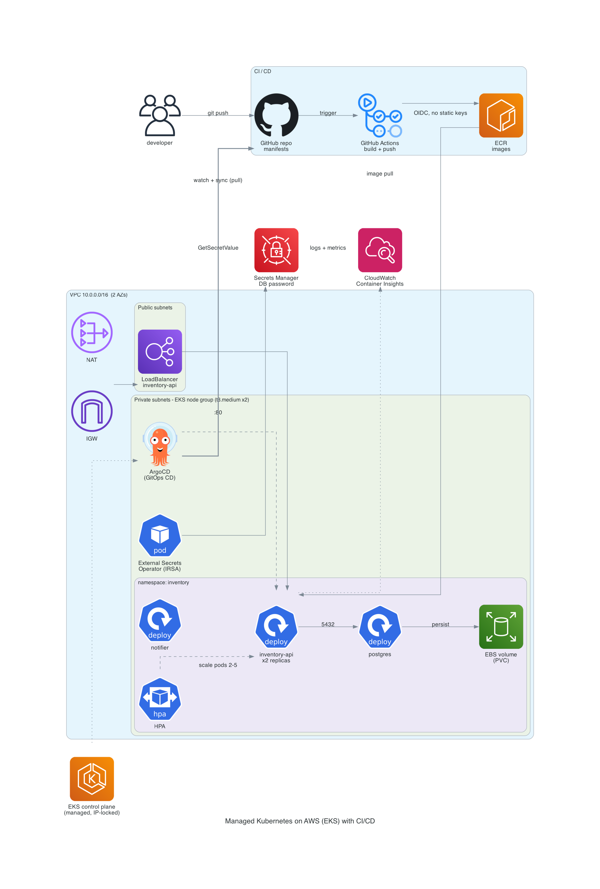

# k8s-ops-lab

A hands-on Kubernetes project for deploying, operating, and troubleshooting
containerized applications across local and AWS environments. It works through 
standing up a cluster, deploying real services, adding CI/CD, and practicing 
failure scenarios.

## Applications

- **inventory-api** — a Go + PostgreSQL REST API.
- **notifier** — a second Go service, used for multi-service networking.

Both run locally (Docker Compose) and on Kubernetes.

## Architecture

The deployment runs on AWS EKS, with CI through GitHub Actions and CD
through ArgoCD. Diagrams for the local and self-managed setups live in
[inventory-api/](inventory-api/) and [cluster-internals/](cluster-internals/).

> Diagrams as code ([Diagrams](https://github.com/mingrammer/diagrams)) — source in [docs/diagrams/](docs/diagrams/).

## Repository structure

| Path | What's there |
|------|--------------|
| `inventory-api/` | Go + PostgreSQL API: source, Dockerfile, Compose, and Kubernetes manifests |
| `notifier/` | Second Go service and its manifests |
| `cluster-internals/` | A self-managed Kubernetes cluster on EC2 (Terraform + Ansible with kubeadm) |
| `eks/` | The same workloads on AWS EKS: Terraform infrastructure, manifests, and notes |
| `.github/workflows/` | CI: builds both images and pushes them to ECR via GitHub OIDC |
| `cd/` | Continuous delivery with ArgoCD (pull-based GitOps) |
| `ops-labs/` | Troubleshooting scenarios (CrashLoopBackOff, ImagePullBackOff, failed health checks, service misconfiguration, scaling, networking) |

## What it demonstrates

- Running Kubernetes two ways: self-managed with kubeadm, and managed with EKS.
- Infrastructure as code with Terraform, and configuration with Ansible.
- Secrets managed externally (AWS Secrets Manager via External Secrets Operator),
  authenticated with IRSA (IAM Roles for Service Accounts)
- A CI/CD pipeline: CI builds and pushes images; ArgoCD reconciles the cluster
  to match this repo.
- Health probes, autoscaling, observability, and a set of
  deliberate break/fix exercises.
