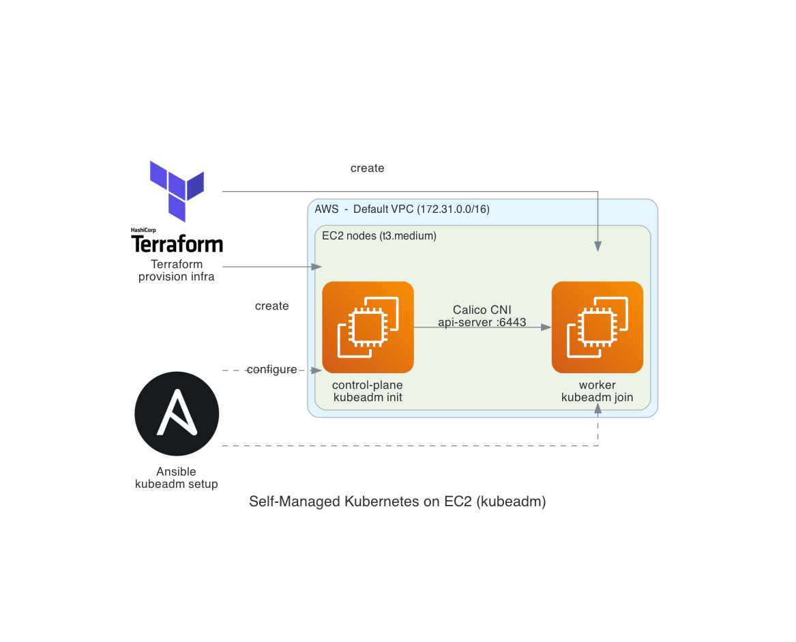

# Self-Managed Kubernetes on EC2

A Kubernetes cluster built from scratch on AWS EC2 with `kubeadm`, to understand
what managed services like EKS handle for you. Terraform provisions the
infrastructure; Ansible configures the nodes and runs `kubeadm`.

- **Terraform** (`terraform/`) provisions two `t3.medium` EC2 instances
  (control-plane + worker) and their security group in the default VPC.
- **Ansible** (`ansible/`) installs prerequisites, runs `kubeadm init` on the
  control plane, installs the Calico CNI, and joins the worker with
  `kubeadm join`.
- `setup/manual-setup.md` documents the manual walkthrough; `notes/` captures
  observations from building it.
