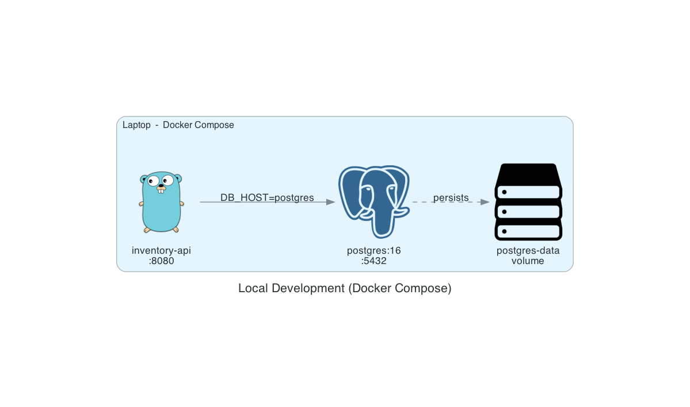

# Inventory API

A Go + PostgreSQL inventory API deployed on Kubernetes.

## Prerequisites

Before deploying to Kubernetes, create the database secret:

```bash
kubectl create secret generic inventory-secret \
  --namespace inventory \
  --from-literal=DB_PASSWORD=yourpassword
```

## Local Development

Copy `.env.example` to `.env` and fill in your values, then:

```bash
docker-compose up
```



## Kubernetes Deployment

```bash
# build and load the image into kind
make build-load VERSION=v1

# apply all manifests
make deploy
```

## API Endpoints

| Method | Path | Description |
|--------|------|-------------|
| GET | /health | Health check |
| GET | /products | List all products |
| GET | /products/{id} | Get a product |
| POST | /products | Create a product |
